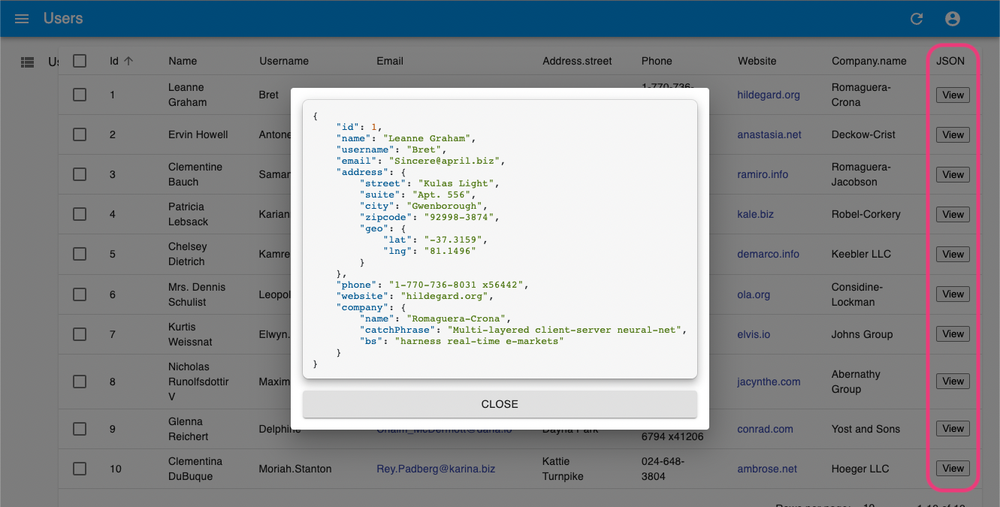

# React Admin Typescript Example

This projects adds a show json button column to the react-admin tutorial using typescript

### Features
1. Json is shown in a individual dialog
2. Json is shown with code highlight by [highlight.js](https://github.com/highlightjs/highlight.js/)

